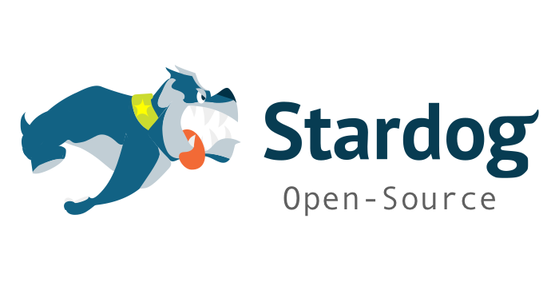
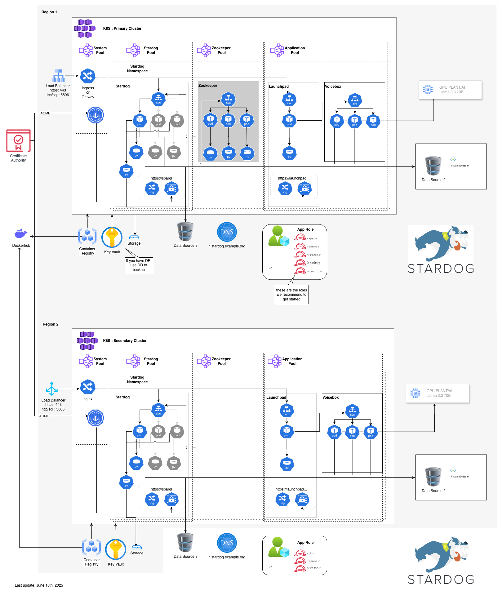

# Kube Stardog Stack



An umbrella Helm chart that manages the complete Stardog ecosystem including Stardog, Launchpad, and Voicebox components.

## Disclaimer & Support Model

The kube-stardog-stack Helm chart and all subcharts are released under the Apache 2.0 License and are provided without express warranty or commercial support.

It will be supported in the same manner as other community-driven open-source projects—through collaborative contributions, issue tracking, and community engagement. As active maintainers and contributors, we will continue to participate in and support the project within the open-source framework alongside the broader user community.

Important: This Helm chart is provided as an open-source artifact, and users should not establish production runtime dependencies on the public Helm repository. For production environments, organizations are strongly advised to pull, version, and store the chart in their own internal artifact repository (e.g., JFrog, Nexus, OCI registry, etc.) to ensure stability, repeatability, and controlled lifecycle management.

This transition ensures a more modern, consolidated, and forward-looking deployment approach while aligning with open-source best practices and enterprise governance standards

## Overview

This chart provides a unified way to deploy and manage the entire Stardog stack with a single Helm release. It includes:

- **Stardog**: The core graph database
- **Cache target**: Optional cache nodes that register against a Stardog cluster
- **Launchpad**: Web-based UI to access Stardog applications (Designer, Explorer, Studio)
- **Voicebox**: Natural language interface for Stardog

## Target Architecture

Architecture is not one-size-fits-all, but this target architecture has worked well in practice. It protects your most expensive database resources while preserving deployment flexibility.



## Components

### Stardog
The core graph database component. Enable with `global.stardog.enabled: true`

### Cache Target
Installs cache target nodes and runs a post-install job that registers them against the primary Stardog cluster or an external endpoint. Enable with `global.cachetarget.enabled: true`.

### Launchpad
Web-based UI to access Stardog applications (Designer, Explorer, Studio). Enable with `global.launchpad.enabled: true`

### Voicebox
Natural language interface for Stardog. Enable with `global.voicebox.enabled: true`

### ZooKeeper
Coordination service for clustered Stardog deployments. Enable with `global.zookeeper.enabled: true`

## Shared Resources

### ClusterIssuer
The ClusterIssuer resource for certificate management is managed by this umbrella chart and will be created if either Stardog or Launchpad has certificate management enabled. This ensures that both components can share the same certificate issuer without conflicts.

## Installation

### Prerequisites (Namespace + License)

Create the namespace and the Stardog license secret before installing the umbrella chart:

```bash
export NAMESPACE=stardog
export LICENSE_FILE=/path/to/stardog-license-key.bin

kubectl create namespace "${NAMESPACE}" --dry-run=client -o yaml | kubectl apply -f -
kubectl create secret generic stardog-license \
  --from-file=stardog-license-key.bin="${LICENSE_FILE}" \
  -n "${NAMESPACE}" --dry-run=client -o yaml | kubectl apply -f -
```

### Distribution & Support

This chart package is **fully vendored (air-gap ready)**. The umbrella chart includes all subcharts in the release artifact, so installs do not require external chart repositories at install time.

We do **not** provide an SLA for retrieving Helm charts directly from GitHub or the public Helm repository. For production, mirror the chart into your own internal Helm repository or artifact store and install from there.

Public Helm repo (no SLA):

```text
https://stardog-oss.github.io/kube-stardog-stack
```

The public Helm repo is unauthenticated; no credentials are required.

Release assets:

```text
https://github.com/stardog-oss/kube-stardog-stack/releases
```

Each component chart maintains its own version. The release tag matches the umbrella chart version, and component versions may or may not change in a given release.

**POC / DEV (Public Helm Repo)**
It is fine to use the public Helm repo for evaluation environments, but no SLA is offered.

```bash
export VERSION=${VERSION}
helm repo add stardog https://stardog-oss.github.io/kube-stardog-stack
helm repo update
helm install my-stardog-stack stardog/kube-stardog-stack --version ${VERSION}
```

**Production (Recommended)**
Download the release artifact and publish it to your internal Helm repo or artifact store. `helm repo add` only registers a URL; it does not remove the upstream dependency. To avoid reliance on GitHub, import the chart into your internal registry.

```bash
export VERSION=${VERSION}
helm repo add stardog https://stardog-oss.github.io/kube-stardog-stack
helm repo update
helm pull stardog/kube-stardog-stack --version ${VERSION}
helm install my-stardog-stack ./kube-stardog-stack-${VERSION}.tgz
```

If you run a local Helm repo, add it and install from there:

```bash
export VERSION=${VERSION}
helm repo add internal ${INTERNAL_HELM_REPO_URL}
helm repo update
helm install my-stardog-stack internal/kube-stardog-stack --version ${VERSION}
```

### Installing Individual Components

Each subchart can be installed on its own using its corresponding chart package (for example `stardog`, `launchpad`, `voicebox`, `gateway`, `zookeeper`, `cachetarget`). In production, mirror these into your internal Helm repo or OCI registry the same way you do for the umbrella chart.

### Basic Installation (Stardog Only)

```bash
helm install my-stardog-stack ./kube-stardog-stack
```

### Installation with All Components

```bash
helm install my-stardog-stack ./kube-stardog-stack \
  --set global.stardog.enabled=true \
  --set global.launchpad.enabled=true \
  --set global.voicebox.enabled=true
```

### Installation with Custom Values

```bash
helm install my-stardog-stack ./kube-stardog-stack -f values.yaml
```

## Configuration

The umbrella chart allows you to enable/disable individual components and configure each one independently.

### Cross-Component Configuration

When multiple components are enabled, you may need to configure them to communicate with each other:

#### Cache Target Registration

When the cache target subchart is enabled it automatically registers itself against the Stardog cluster in the same release. To point it at another release/namespace or an external endpoint, tune the following values:

```yaml
cachetarget:
  enabled: true
  primary:
    name: stardog-secondary         # defaults to stardog-<release>
    namespace: shared-services      # defaults to the release namespace
    port: 5820
    url: cache.stardog.example.com  # optional https endpoint (implies TLS)
    validateService: true           # fail fast if the Service does not exist
    validateConnectivity: true      # have the job curl the endpoint before registering
    skipTLSVerify: false            # set true when using self-signed certs
```

#### Launchpad + Voicebox Integration

When both Launchpad and Voicebox are enabled **outside** of the umbrella chart, Launchpad needs to know how to reach the Voicebox service. (The umbrella chart wires this up automatically whenever both components are enabled.) Configure this manually in Launchpad’s environment variables only when you deploy the charts separately:

```yaml
launchpad:
  env:
    # Auto-configure voicebox service endpoint when both are enabled
    VOICEBOX_SERVICE_ENDPOINT: "http://RELEASE-NAME-voicebox.NAMESPACE.svc.cluster.local:8080"
```

**Note**: Replace `RELEASE-NAME` with your actual Helm release name and `NAMESPACE` with your Kubernetes namespace.

### Component Enablement

| Component | Default | Description |
|-----------|---------|-------------|
| `global.stardog.enabled` | `true` | Deploy Stardog |
| `global.cachetarget.enabled` | `false` | Deploy cache target nodes that register with Stardog |
| `global.launchpad.enabled` | `false` | Deploy Launchpad |
| `global.voicebox.enabled` | `false` | Deploy Voicebox |
| `global.zookeeper.enabled` | `false` | Deploy a shared ZooKeeper ensemble |

### Example Configurations

#### Stardog + Launchpad
```yaml
global:
  stardog:
    enabled: true
  launchpad:
    enabled: true
  voicebox:
    enabled: false

stardog:
  # Stardog configuration here

launchpad:
  # Launchpad configuration here
```

#### Complete Stack
```yaml
global:
  stardog:
    enabled: true
  cachetarget:
    enabled: true
  launchpad:
    enabled: true
  voicebox:
    enabled: true

stardog:
  # Stardog configuration here

cachetarget:
  primary:
    validateConnectivity: true
    skipTLSVerify: false

launchpad:
  # Launchpad configuration here
  env:
    # Configure voicebox service endpoint when both are enabled
    VOICEBOX_SERVICE_ENDPOINT: "http://RELEASE-NAME-voicebox.NAMESPACE.svc.cluster.local:8080"

voicebox:
  # Voicebox configuration here
```

## Usage

### Deploying Individual Components

You can deploy individual components by setting only the desired component to `enabled: true`:

```bash
# Deploy only Stardog
helm install my-launchpad ./kube-stardog-stack \
  --set global.stardog.enabled=true \
  --set global.launchpad.enabled=false \
  --set global.voicebox.enabled=false
```

### Advanced Configuration

Create a comprehensive values file:

```yaml
global:
  stardog:
    enabled: true
  launchpad:
    enabled: true
  voicebox:
    enabled: true

stardog:
  image:
    registry: your-registry.com
    repository: your-org/stardog
    tag: latest
  persistence:
    size: 20Gi
  resources:
    requests:
      memory: "2Gi"
      cpu: "1"
    limits:
      memory: "4Gi"
      cpu: "2"

launchpad:
  image:
    registry: your-registry.com
    repository: your-org/launchpad
    tag: latest
  ingress:
    enabled: true
    url: "your-domain.com"
  env:
    FRIENDLY_NAME: "My Stardog Applications"
    STARDOG_INTERNAL_ENDPOINT: "http://my-stardog-stack-stardog:5820"

voicebox:
  image:
    registry: your-registry.com
    repository: your-org/voicebox
    tag: latest
  environmentVariables:
    AZURE_API_KEY: "your-azure-api-key"
    PRODUCTION: 1
```

## Upgrading

```bash
helm upgrade my-stardog-stack ./kube-stardog-stack
```

## Uninstalling

```bash
helm uninstall my-stardog-stack
```

## Dry-Run & CI Rendering

The charts validate required secrets during rendering. For `helm template` or other dry-run flows where those secrets are not present in the cluster (for example in CI), load `values.skip-secret-validation.yaml` (or set `global.skipSecretValidation=true`) to bypass the lookups while still producing manifests. Leave it disabled for real installs so missing secrets still fail fast.

```bash
helm template my-stardog-stack ./kube-stardog-stack -f values.skip-secret-validation.yaml
```

## Component Documentation

For detailed configuration options for each component, see:

- [Stardog Chart](./charts/stardog/README.md)
- [Cache Target Chart](./charts/cachetarget/README.md)
- [Launchpad Chart](./charts/launchpad/README.md)
- [Voicebox Chart](./charts/voicebox/README.md)
- [Gateway Chart](./charts/gateway/README.md)
- [Zookeeper Chart](./charts/zookeeper/README.md)
- [Common Chart](./charts/common/README.md)

## Benefits of the Umbrella Chart

1. **Single Deployment**: Deploy the entire Stardog ecosystem with one command
2. **Unified Configuration**: Manage all components from a single values file
3. **Flexible Composition**: Enable only the components you need
4. **CI/CD Friendly**: Simplified pipeline integration
5. **Independent Charts**: Each component can still be deployed independently

## Troubleshooting

### Common Issues

1. **Dependency Resolution**: Ensure all sub-charts are available in the `charts/` directory
2. **Image Pull Errors**: Verify registry credentials for all components
3. **Resource Conflicts**: Check for port or name conflicts between components

### Component Status

Check the status of all components:

```bash
kubectl get all -l app.kubernetes.io/instance=my-stardog-stack
```

### Verify TLS Certificate with OpenSSL

Use SNI to confirm the certificate served for a specific hostname:

```bash
HOST=launchpad.example.com
openssl s_client -connect "${HOST}:443" -servername "${HOST}" -showcerts </dev/null 2>/dev/null \
  | openssl x509 -noout -subject -issuer -ext subjectAltName
```

### Individual Component Logs

```bash
# Stardog logs
kubectl logs -l app=my-stardog-stack-stardog

# Launchpad logs
kubectl logs -l app=my-stardog-stack-launchpad

# Voicebox logs
kubectl logs -l app=my-stardog-stack-voicebox
```

## Contributing

We welcome contributions from the community. Please follow the workflow below:

Requirements:

- Helm installed: <https://helm.sh/docs/intro/install/>
- `helm-unittest` plugin:
  ```bash
  helm plugin install https://github.com/helm-unittest/helm-unittest
  ```

1. Clone the repository:
   ```bash
   git clone https://github.com/stardog-oss/kube-stardog-stack
   ```
2. Enable the pre-commit hook:
   ```bash
   git config core.hooksPath .githooks
   ```
3. Create a branch and open a pull request.

Maintainers may reach out to move your PR to a release branch depending on timing and release planning.
