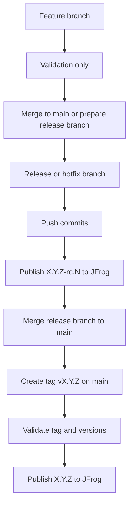

# Release Process

This document explains how to produce release candidates and official releases for the Helm charts in this repository.

## Summary

- Feature branches run validation only.
- `main` runs validation only.
- Release and hotfix branches publish release candidates to JFrog.
- A manual `vX.Y.Z` tag on `main` publishes the final `X.Y.Z` release to JFrog.

## Branch types

- Feature branch example: `SAT-622-improve-docs`
- Release branch example: `SAT-686-release-v-1-1-0`
- Hotfix branch example: `SAT-701-hotfix-cache-config`

The release and hotfix workflow accepts branch names that match:

```text
^SAT-[0-9]+-(release|hotfix)(-.+)?$
```

## Versioning model

- `Chart.yaml` stores the target final version, for example `1.1.0`
- Release candidate builds derive `1.1.0-rc.<run>`
- Final tagged releases publish exact `1.1.0`

This means you bump the version once for the release line, not for every release candidate build.

## Flow



## Release candidate process

1. Create a release or hotfix branch from the appropriate base.
2. Bump the target chart versions in `Chart.yaml`.
3. Update the matching `CHANGELOG.md` entries.
4. Push commits to the release or hotfix branch.
5. The workflow publishes `X.Y.Z-rc.<run>` packages to JFrog.
6. Continue iterating on the same branch without bumping versions for each RC.

## Official release process

1. Merge the release or hotfix branch into `main`.
2. Ensure the final chart versions on `main` are the intended release versions.
3. Create and push a tag from `main`.

Example:

```bash
git checkout main
git pull
git tag v1.1.0
git push origin v1.1.0
```

4. The tag workflow validates the release and publishes exact `X.Y.Z` packages to JFrog.

## Release safety checks

On a `vX.Y.Z` tag, the workflow checks:

- the tag format is `vX.Y.Z`
- the tagged commit is reachable from `main`
- the umbrella `Chart.yaml` version matches the tag
- any chart content changed since the previous release tag must have a bumped version
- each chart version has a matching `CHANGELOG.md` entry

## What is not enforced locally

The local pre-commit hook does not force version bumps anymore.

It still checks:

- changelog entries
- dependency lock sync
- `helm lint`
- `helm unittest`

Strict version-bump enforcement happens only in the final release tag workflow.

## Workflow map

- `.github/workflows/ci-features.yml`: feature validation
- `.github/workflows/ci-main.yml`: main validation
- `.github/workflows/ci-develop.yml`: release and hotfix RC publishing
- `.github/workflows/ci-release-tags.yml`: final tagged releases
- `.github/workflows/helm-validate-reusable.yml`: shared validation logic
- `.github/workflows/helm-package-reusable.yml`: shared JFrog packaging and push logic
