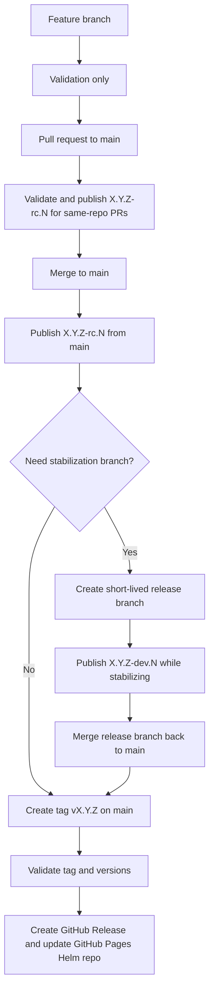

# Release Process

This document explains how to produce release candidates and official releases for the Helm charts in this repository.

## Summary

Most work should happen through pull requests to `main`. Git release tags preserve the exact source used for a release, so long-lived release branches are not needed for reproducibility.

Use branches as temporary work pointers:

- `main`: primary development and release line.
- feature branches: short-lived branches for individual changes, merged by PR to `main`.
- release branches: optional short-lived stabilization branches only when a release needs hardening while `main` keeps moving.
- hotfix branches: temporary branches created from a release tag when a released version needs a patch.

Use tags as permanent release pointers:

- `vX.Y.Z` tags identify the exact commit used for an official release.
- Release and hotfix branches can be deleted after the tag exists and the fix is reconciled.
- Deleting a branch does not remove the release history as long as the release tag remains.

- Feature branches run validation only.
- Pull requests to `main` run validation, and same-repository pull requests publish RC packages after validation succeeds.
- `main` publishes release candidate packages to JFrog.
- Release branches are optional short-lived stabilization branches, not long-running development branches.
- Hotfix branches are created from release tags only when a supported patch release is needed.
- Release and hotfix branches publish dev packages to JFrog while they are active.
- A manual `vX.Y.Z` tag on `main` creates the official GitHub Release and updates the GitHub Pages Helm repo.

## Branch types

- Feature branch example: `SAT-622-improve-docs`
- Release branch example: `SAT-686-release-v-1-1-0`
- Hotfix branch example: `SAT-701-hotfix-cache-config`

The release and hotfix workflow accepts branch names that match:

```text
^SAT-[0-9]+-(release|hotfix)(-.+)?$
```

Release branches should be created near feature freeze when a release needs a short stabilization period. Do not use a release branch as the primary development branch for the next minor release. Normal feature work should target `main` through pull requests.

Hotfix branches should be created from the released tag that needs to be patched. They can be deleted after the hotfix tag exists and the fix has been reconciled back to `main`.

## Versioning model

- `Chart.yaml` stores the target final version, for example `1.1.0`
- `main` builds derive `1.1.0-rc.<run>`
- Release and hotfix builds derive `1.1.0-dev.<run>`
- Final tagged releases publish exact `1.1.0`

This means you bump the version once for the release line, not for every release candidate build.

## Flow



## Release candidate process

1. Open a pull request to `main` with the intended release content.
2. Ensure target chart versions in `Chart.yaml` are the intended final versions.
3. Update the matching `CHANGELOG.md` entries.
4. The pull request runs validation.
5. If the pull request branch lives in this repository, the workflow publishes `X.Y.Z-rc.<run>` packages to JFrog after validation succeeds.
6. After merge, pushes to `main` also publish `X.Y.Z-rc.<run>` packages.
7. Continue iterating until the release content is ready to tag.

## Optional stabilization branch process

Use this only when the release needs a short stabilization window while `main` continues moving.

1. Create a release branch from `main` near feature freeze.
2. Keep the target chart versions in `Chart.yaml` at the intended final versions.
3. Update the matching `CHANGELOG.md` entries as needed.
4. Limit changes on the release branch to bug fixes, docs, version cleanup, and release validation fixes.
5. Push commits to the release branch.
6. The workflow publishes `X.Y.Z-dev.<run>` packages to JFrog.
7. Merge the release branch back to `main` before creating the final release tag.
8. Delete the release branch after the tag exists and any release-only fixes have been reconciled.

## Official release process

1. Ensure the final chart versions on `main` are the intended release versions.
2. Ensure matching `CHANGELOG.md` entries are present.
3. Create and push a tag from `main`.

Example:

```bash
git checkout main
git pull
git tag v1.1.0
git push origin v1.1.0
```

4. The tag workflow validates the release, creates the GitHub Release assets, and updates the GitHub Pages Helm repo.

If the tag already exists and the tag workflow did not publish the GitHub release, run the `Helm Release (GitHub)` workflow manually with `release_tag` set to the existing tag, for example `v1.1.0`.

## Hotfix process

Create hotfix branches only when an already released version needs a patch.

1. Create the hotfix branch from the release tag that needs the fix.

```bash
git fetch --tags
git switch -c SAT-701-hotfix-v-1-1-1 v1.1.0
```

2. Apply the fix and update the affected `Chart.yaml` and `CHANGELOG.md` versions, for example from `1.1.0` to `1.1.1`.
3. Push the hotfix branch for validation and dev package publishing.
4. Reconcile the fix back to `main` by merge, cherry-pick, or an equivalent fix adapted to the current code.
5. Create the official hotfix tag only from a commit reachable from `main`.

```bash
git checkout main
git pull
git tag v1.1.1
git push origin v1.1.1
```

6. Delete the hotfix branch after the tag exists and the fix is reconciled.

The hotfix branch is not required for long-term reproducibility. The release tag is the permanent pointer to the released source.

Important: the current `ci-release-tags.yml` workflow requires every official `vX.Y.Z` release tag to point to a commit reachable from `origin/main`. If the project wants to publish hotfix releases directly from isolated patch branches, the workflow must be changed to allow tags whose commits are reachable from an approved hotfix branch. Until then, hotfix branches are for validation and dev packages, and official release tags are created from `main`.

## Release safety checks

On a `vX.Y.Z` tag, the workflow checks:

- the tag format is `vX.Y.Z`
- the tagged commit is reachable from `main`
- the umbrella `Chart.yaml` version matches the tag
- any chart content changed since the previous release tag must have a bumped version
- each chart version has a matching `CHANGELOG.md` entry

## What is not enforced locally

The local pre-commit hook does not force version bumps anymore.

It still checks:

- changelog entries
- dependency lock sync
- `helm lint`
- `helm unittest`

Strict version-bump enforcement happens only in the final release tag workflow.

## Workflow map

- `.github/workflows/ci-features.yml`: feature validation
- `.github/workflows/ci-main.yml`: main validation plus RC packaging for `main` and same-repository PRs to `main`
- `.github/workflows/ci-develop.yml`: release and hotfix dev packaging and publish
- `.github/workflows/ci-release-tags.yml`: final tagged GitHub releases
- `.github/workflows/helm-validate-reusable.yml`: shared validation logic
- `.github/workflows/helm-package-reusable.yml`: shared JFrog packaging and push logic
- `.github/workflows/helm-github-release.yml`: shared GitHub Release and GitHub Pages Helm repo publishing logic
